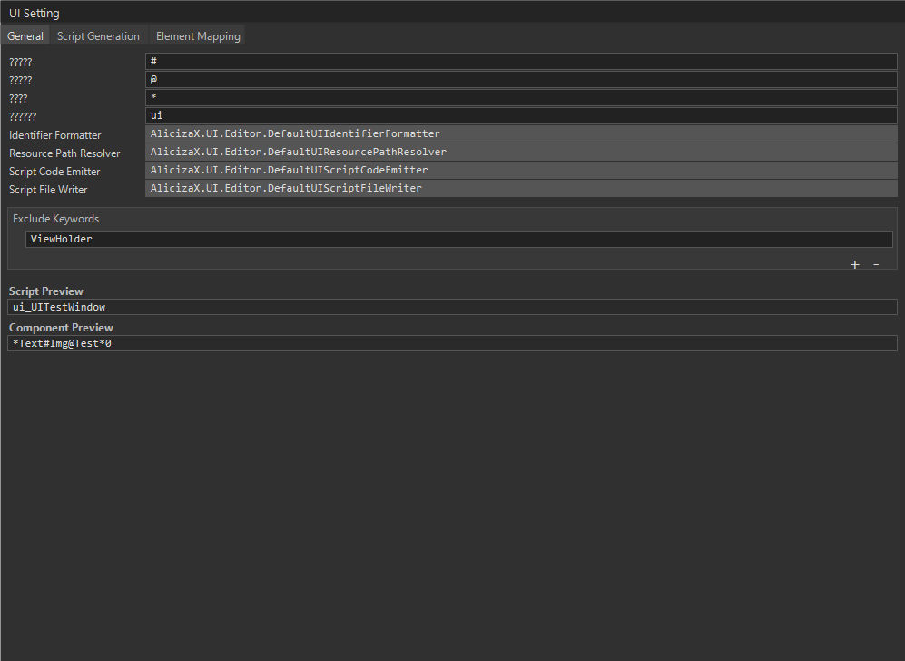
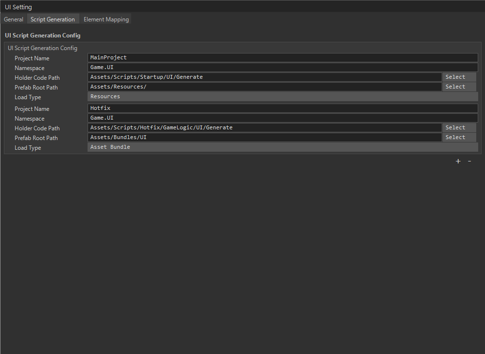
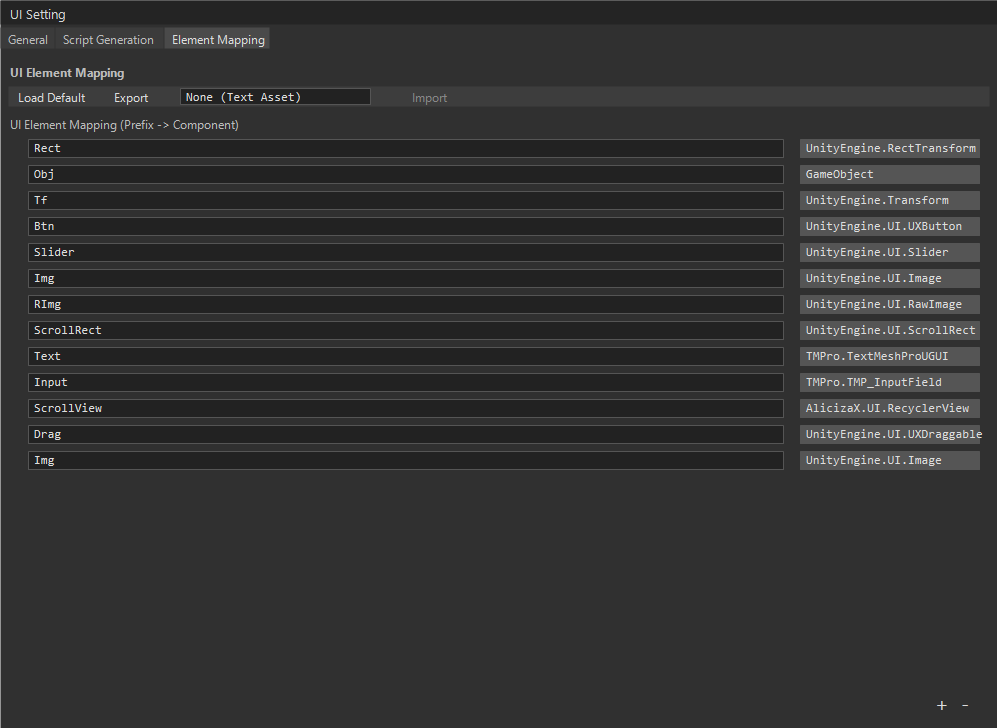
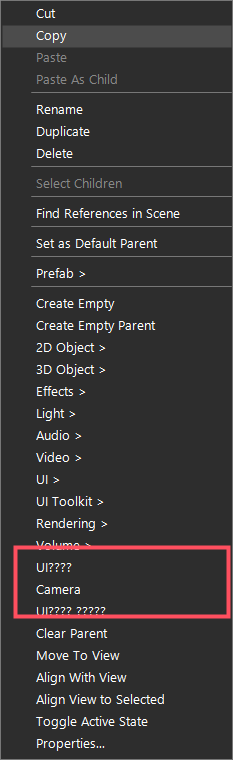

# UI 模块

UI 模块提供窗口创建、显示、关闭、层级管理、缓存、窗口生命周期、子组件 Widget、Tab 界面和 UI 事件自动解绑能力。窗口逻辑继承 `UIWindow<T>`、`UITabWindow<T>` 或 `UIWidget<T>`，其中 `T` 是自动生成的继承 `UIHolderObjectBase`。

源码位置：

- `Client/Packages/com.alicizax.unity.framework/Runtime/UI`
- 项目示例：`Client/Assets/Scripts/Hotfix/GameLogic/UI`

## 使用前提

场景中的框架根节点需要挂载：

- `ObjectPoolComponent`
- `TimerComponent`
- `ResourceComponent`
- `UIComponent`

`UIComponent` Inspector 中需要配置 `uiRoot` 预制体。运行时会实例化 UI 根节点，注册 `IUIService`，并根据 `UILayer` 创建各层级根节点。

```csharp
using AlicizaX;
using AlicizaX.UI.Runtime;

IUIService ui = AppServices.Require<IUIService>();
```

快捷入口：

```csharp
IUIService ui = GameApp.UI;
```

## UI 层级

```csharp
public enum UILayer
{
    Background = 0,
    Scene = 1,
    UI = 2,
    Popup = 3,
    Tips = 4,
    Top = 5,
    All = 6
}
```

常用约定：

- `Background`：背景层。
- `Scene`：2D 场景信息、血条、飘字等。
- `UI`：普通全屏或主界面。
- `Popup`：弹窗。
- `Tips`：提示、Toast。
- `Top`：最上层遮罩或系统提示。

## UI绑定工具自动生成的Holder有哪些
生成类禁止手动修改

Holder 会自动挂在 UI 预制体上，负责暴露序列化控件。生成工具会生成类似下面的代码：

```csharp
using AlicizaX.UI.Runtime;
using UnityEngine;
using UnityEngine.UI;

namespace Game.UI
{
    [UIRes(ui_LoginWindow.ResTag, EUIResLoadType.AssetBundle)]
    public class ui_LoginWindow : UIHolderObjectBase
    {
        public const string ResTag = "LoginWindow";

        [SerializeField] private Button mBtnLogin;
        public Button BtnLogin => mBtnLogin;

        [SerializeField] private Text mTxtTitle;
        public Text TxtTitle => mTxtTitle;
    }
}
```

`UIResAttribute` 用于描述 UI 预制体加载地址：

- `EUIResLoadType.AssetBundle`：通过 `IResourceService` 加载。
- `EUIResLoadType.Resources`：通过 Unity `Resources.Load` 加载。

## 编辑器生成 Holder

框架提供 UI 绑定脚本生成工具，用于从 UI 预制体层级自动生成 Holder 类，并把控件引用序列化回预制体。入口在 Unity 菜单：

```text
AlicizaX/UISetting Window
```

打开后会看到 `General`、`Script Generation`、`Element Mapping` 三个页签。



### General 配置

`General` 页签控制命名规则和生成辅助类：

| 配置 | 说明 |
| --- | --- |
| `组件分割符` | 控件类型前缀和字段名之间的分隔符，默认 `#` |
| `组件结尾符` | 生成规则的结尾标记，默认 `@` |
| `数组分割` | 数组控件分组标记，默认 `*` |
| `生成脚本前缀` | Holder 类名前缀，默认 `ui`，例如 `UILoadUpdateWindow` 生成 `ui_UILoadUpdateWindow` |
| `Identifier Formatter` | 控制字段名、属性名、类名格式化 |
| `Resource Path Resolver` | 控制 `UIResAttribute` 中的资源路径 |
| `Script Code Emitter` | 控制 Holder 代码内容生成 |
| `Script File Writer` | 控制生成文件写入方式和自动挂载流程 |
| `Exclude Keywords` | 命中关键字的节点不参与绑定，默认排除 `ViewHolder` |

截图中的 `Script Preview` 和 `Component Preview` 会根据当前规则预览生成结果。例如：

```text
ui_UITestWindow
*Text#Img@Test*0
```

### Script Generation 配置

`Script Generation` 页签用于配置不同 UI 项目的生成路径、命名空间、Prefab 根目录和加载方式。工具会按选中 Prefab 的资源路径匹配 `Prefab Root Path`，命中哪条配置就使用哪条配置生成。



项目里常见两套配置：

| Project Name | Namespace | Holder Code Path | Prefab Root Path | Load Type |
| --- | --- | --- | --- | --- |
| `MainProject` | `Game.UI` | `Assets/Scripts/Startup/UI/Generate` | `Assets/Resources/` | `Resources` |
| `Hotfix` | `Game.UI` | `Assets/Scripts/Hotfix/GameLogic/UI/Generate` | `Assets/Bundles/UI` | `Asset Bundle` |

配置含义：

- `Project Name`：只用于区分配置项。
- `Namespace`：生成 Holder 类所在命名空间。
- `Holder Code Path`：生成 `.cs` 文件的位置。
- `Prefab Root Path`：允许生成绑定的 UI 预制体根目录。
- `Load Type`：决定 `UIResAttribute` 使用 `Resources` 还是 `AssetBundle`。

例如 Hotfix 配置下，`Assets/Bundles/UI/UILoadUpdateWindow.prefab` 会生成：

```csharp
namespace Game.UI
{
    [UIRes(ui_UILoadUpdateWindow.ResTag, EUIResLoadType.AssetBundle)]
    public class ui_UILoadUpdateWindow : UIHolderObjectBase
    {
        public const string ResTag = "UILoadUpdateWindow";
    }
}
```

如果 YooAsset 开启 Addressable，AssetBundle 模式下的 `ResTag` 会优先使用预制体名；否则会使用去掉扩展名后的 `Assets/...` 路径。

### Element Mapping 配置

`Element Mapping` 页签用于配置“节点名前缀 -> 组件类型”的映射。



常用映射示例：

| 前缀 | 组件类型 |
| --- | --- |
| `Rect` | `UnityEngine.RectTransform` |
| `Obj` | `GameObject` |
| `Tf` | `UnityEngine.Transform` |
| `Btn` | `UnityEngine.UI.UXButton` |
| `Slider` | `UnityEngine.UI.Slider` |
| `Img` | `UnityEngine.UI.Image` |
| `RImg` | `UnityEngine.UI.RawImage` |
| `Text` | `TMPro.TextMeshProUGUI` |
| `Input` | `TMPro.TMP_InputField` |
| `ScrollView` | `AlicizaX.UI.RecyclerView` |
| `Drag` | `UnityEngine.UI.UXDraggable` |

节点名以映射前缀开头时，生成器会查找该节点上可赋值给目标类型的组件。前缀只用于生成规则，真正字段类型以节点上实际组件类型为准。

### 命名规则

普通控件命名格式：

```text
前缀@字段名
```

示例：

```text
Btn@Login
Img@BackGround
Text@Title
ScrollView@ItemList
```

会生成类似：

```csharp
[SerializeField]
private UXButton mBtnLogin;
public UXButton BtnLogin => mBtnLogin;

[SerializeField]
private Image mImgBackGround;
public Image ImgBackGround => mImgBackGround;
```

一个节点需要绑定多个组件时，可以写多个前缀：

```text
Btn#Img@Close
```

数组控件命名格式：

```text
*前缀#@字段名*序号
```

示例：

```text
*Img@Star*0
*Img@Star*1
*Img@Star*2
```

会按序号排序并生成数组字段：

```csharp
[SerializeField]
private Image[] mImgStarList = new Image[3];
public Image[] ImgStarList => mImgStarList;
```

Widget 节点不需要写绑定符号。只要子节点上挂了 `UIHolderObjectBase`，生成器会把它作为 Widget 引用收集；如果节点名同时包含 `#` 和 `@`，会被认为是错误命名。

### 生成绑定

完成配置和节点命名后，对 UI 预制体执行生成：

1. 保存 UI 为 Prefab，或者在 Prefab Mode 中编辑该 Prefab。
2. 确认 Prefab 路径位于某条 `Prefab Root Path` 下。
3. 在 Hierarchy 或 Prefab 根节点上右键。
4. 点击 `UI生成绑定`。
5. 等待脚本生成、Unity 编译完成后，工具会自动把 Holder 脚本挂到 Prefab，并回填序列化字段。



右键菜单说明：

| 菜单 | 说明 |
| --- | --- |
| `UI生成绑定` | 生成 Holder 脚本、刷新 AssetDatabase、编译后自动挂载脚本并绑定字段 |
| `UI生成绑定 仅复制属性` | 只把字段和属性代码复制到剪贴板，不写入文件 |

生成器要求目标是 Prefab Asset 或正在编辑的 Prefab。直接对普通场景物体执行 `UI生成绑定` 会提示先保存为 UI Prefab。

### 生成结果示例

以项目里的 `UILoadUpdateWindow` 为例，预制体在 `Assets/Bundles/UI` 下，命中 Hotfix 配置后会生成到：

```text
Assets/Scripts/Hotfix/GameLogic/UI/Generate/ui_UILoadUpdateWindow.cs
```

生成结果节选：

```csharp
using AlicizaX.UI;
using UnityEngine;
using UnityEngine.UI;
using AlicizaX.UI.Runtime;

namespace Game.UI
{
    [UIRes(ui_UILoadUpdateWindow.ResTag, EUIResLoadType.AssetBundle)]
    public class ui_UILoadUpdateWindow : UIHolderObjectBase
    {
        public const string ResTag = "UILoadUpdateWindow";

        [SerializeField]
        private UXButton mBtnTest;
        public UXButton BtnTest => mBtnTest;

        [SerializeField]
        private Image mImgBackGround;
        public Image ImgBackGround => mImgBackGround;

        [SerializeField]
        private RecyclerView mScrollViewTestList;
        public RecyclerView ScrollViewTestList => mScrollViewTestList;
    }
}
```

窗口逻辑中直接通过 `baseui` 使用这些引用：

```csharp
[Window(UILayer.UI, false, 3)]
public class UILoadUpdate : UITabWindow<ui_UILoadUpdateWindow>
{
    protected override void OnInitialize()
    {
        baseui.ImgBackGround.color = Color.gray;
        baseui.BtnTest.onClick.AddListener(OnTestClick);
    }
}
```

### 常见问题

1. 右键生成后提示没有配置：先打开 `AlicizaX/UISetting Window`，在 `Script Generation` 中添加至少一条配置。
2. 提示没有找到符合规则路径的生成配置：检查 Prefab 是否在 `Prefab Root Path` 下。
3. 生成后字段为空：检查节点名是否包含正确的 `#` 和 `@`，以及节点上是否真的挂了对应组件。
4. 字段重复：同一个 Prefab 内不要生成相同的字段名，例如两个 `Btn#Close@` 会冲突。
5. 子 Widget 被重复扫描：Widget 节点名不要写绑定符号，只需要挂 `UIHolderObjectBase`。
6. `ViewHolder` 节点没有生成字段：默认被 `Exclude Keywords` 排除，如需生成请修改排除关键字。

## 定义窗口逻辑

```csharp
using AlicizaX;
using AlicizaX.UI.Runtime;
using Game.UI;

[Window(UILayer.UI, fullScreen: true, cacheTime: 30)]
public sealed class LoginWindow : UIWindow<ui_LoginWindow>
{
    protected override void OnInitialize()
    {
        baseui.BtnLogin.onClick.AddListener(OnLoginClick);
        baseui.TxtTitle.text = "Login";
    }

    protected override void OnOpen()
    {
        Log.Info("Login window opened");
    }

    protected override void OnClose()
    {
        Log.Info("Login window closed");
    }

    private void OnLoginClick()
    {
        CloseSelf();
    }
}
```

`WindowAttribute` 参数：

- `windowLayer`：窗口显示层级。
- `fullScreen`：是否全屏窗口。
- `cacheTime`：缓存时间，`-1` 永久缓存，`0` 不缓存，`>=1` 按秒缓存。

需要每帧更新时添加 `UIUpdateAttribute`：

```csharp
[UIUpdate]
[Window(UILayer.UI)]
public sealed class BattleHudWindow : UIWindow<ui_BattleHudWindow>
{
    protected override void OnUpdate()
    {
        RefreshHpBar();
    }
}
```

## 打开和关闭窗口

推荐异步打开：

```csharp
using AlicizaX;
using Cysharp.Threading.Tasks;

public sealed class LoginEntry
{
    public async UniTask OpenLogin()
    {
        LoginWindow window = await GameApp.UI.ShowUI<LoginWindow>("from_startup");
    }
}
```

同步打开适合资源已可同步加载或已预热的窗口：

```csharp
LoginWindow window = GameApp.UI.ShowUISync<LoginWindow>();
```

关闭窗口：

```csharp
GameApp.UI.CloseUI<LoginWindow>();

// force 为 true 时会强制移除缓存。
GameApp.UI.CloseUI<LoginWindow>(force: true);
```

窗口内部关闭自己：

```csharp
CloseSelf();
```

获取已打开窗口：

```csharp
LoginWindow login = GameApp.UI.GetUI<LoginWindow>();
```

## 接收打开参数

`ShowUI` 和 `ShowUISync` 的 `params object[] userDatas` 会传到窗口内部。

```csharp
public sealed class ItemTipsWindow : UIWindow<ui_ItemTipsWindow>
{
    protected override void OnOpen()
    {
        int itemId = UserData is int value ? value : 0;
        baseui.TxtItemId.text = itemId.ToString();
    }
}

GameApp.UI.ShowUISync<ItemTipsWindow>(10001);
```

多个参数可通过 `UserDatas` 读取。

## UI 事件自动解绑

窗口可以重写 `OnRegisterEvent`，通过 `EventListenerProxy` 注册事件。窗口销毁时会自动取消订阅。

```csharp
using AlicizaX;
using AlicizaX.Localization;
using AlicizaX.UI.Runtime;
using Game.UI;

public sealed class SettingsWindow : UIWindow<ui_SettingsWindow>
{
    protected override void OnRegisterEvent(EventListenerProxy proxy)
    {
        proxy.AddUIEvent<LocalizationChangeEvent>(OnLanguageChanged);
    }

    private void OnLanguageChanged(in LocalizationChangeEvent evt)
    {
        RefreshText();
    }
}
```

## 创建 Widget

`UIWidget<T>` 适合窗口内部的子界面、分页内容、列表项详情等。

```csharp
using AlicizaX.UI.Runtime;
using Cysharp.Threading.Tasks;
using Game.UI;

[Window(UILayer.UI)]
public sealed class BagWindow : UIWindow<ui_BagWindow>
{
    private BagDetailWidget _detail;

    protected override async UniTask OnOpenAsync()
    {
        _detail = await CreateWidgetAsync<BagDetailWidget>(baseui.DetailRoot);
        _detail.Open(10001);
    }

    protected override void OnClose()
    {
        if (_detail != null)
        {
            RemoveWidget(_detail).Forget();
            _detail = null;
        }
    }
}

public sealed class BagDetailWidget : UIWidget<ui_BagDetailWidget>
{
    protected override void OnOpen()
    {
        int itemId = UserData is int value ? value : 0;
        baseui.TxtItemId.text = itemId.ToString();
    }
}
```

也可以同步创建：

```csharp
BagDetailWidget detail = CreateWidgetSync<BagDetailWidget>(baseui.DetailRoot);
```

## Tab 窗口

`UITabWindow<T>` 内置虚拟 Tab 注册和切换。

```csharp
using AlicizaX.UI.Runtime;
using Game.UI;

[Window(UILayer.UI)]
public sealed class RoleWindow : UITabWindow<ui_RoleWindow>
{
    protected override void OnInitialize()
    {
        InitTabVirtuallyView<RoleInfoTab>(baseui.TabRoot);
        InitTabVirtuallyView<RoleEquipTab>(baseui.TabRoot);

        baseui.BtnInfo.onClick.AddListener(() => SwitchTab(0));
        baseui.BtnEquip.onClick.AddListener(() => SwitchTab(1));
    }
}
```

第一次切换到某个 Tab 时会异步创建，后续切换复用已加载实例。

## 手动创建Holder
```csharp
using AlicizaX.UI.Runtime;
using Game.UI;

[Window(UILayer.UI)]
public sealed class RoleWindow : UITabWindow<ui_RoleWindow>
{
    protected override void OnInitialize()
    {
        //可能会有手动创建多个一样的Holder进行操作 该API提供创建 
        //但是具体维护销毁交给自己来处理
        //常见场景 比如Tips 小提示 可能自己去创建多个Holder然后不走Widget
        //只是多一种选择给你 可用可不用
        UIHolderFactory.CreateUIHolderAsync<ui_UILogicTestAlert>("父物体");
    }
}
```


## API 速查

| API | 说明 |
| --- | --- |
| `IUIService.ShowUI<T>(params object[])` | 异步打开窗口 |
| `IUIService.ShowUI(string, params object[])` | 按类型名异步打开窗口 |
| `IUIService.ShowUISync<T>(params object[])` | 同步打开窗口 |
| `IUIService.CloseUI<T>(bool force)` | 关闭窗口 |
| `IUIService.GetUI<T>()` | 获取已打开窗口 |
| `IUIService.GetLayer(UILayer)` | 获取层级根节点 |
| `UIWindow<T>.CloseSelf()` | 窗口内部关闭自己 |
| `UIBase.CreateWidgetAsync<T>()` | 创建子 Widget |
| `UIBase.RemoveWidget(UIBase)` | 移除子 Widget |
| `UIMetaRegistry.Register(...)` | 手动注册窗口元数据 |
| `UIResRegistry.Register(...)` | 手动注册 Holder 资源 |

## 注意事项

1. `UIResAttribute` 应写在 Holder 类上，不是窗口逻辑类上。
2. `WindowAttribute` 写在窗口逻辑类上，用于描述层级、全屏和缓存。
3. 异步生命周期重写 `OnInitializeAsync`、`OnOpenAsync`、`OnCloseAsync` 时，同步版本不会自动再调用，除非你在重写方法里主动调用。
4. `ShowUISync` 只适合同步资源可用的场景，常规业务优先使用 `ShowUI<T>()`。
5. UI 依赖 `ObjectPool`、`Timer` 和 `Resource`，组件注册顺序需要在启动场景中保证。
