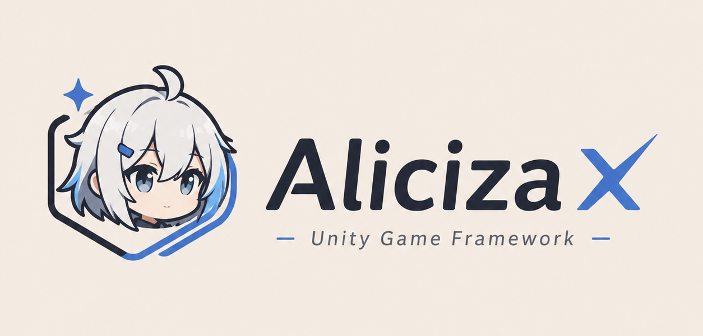

# AlicizaX

<div align="center">



**模块化 Unity 框架模板，覆盖启动流程、热更新、资源管理与 UI 工作流。**

[](https://unity.com/)
[](https://github.com/AlicizaX/AlicizaXTemplate)
[](https://github.com/AlicizaX/AlicizaXTemplate)
[](https://github.com/AlicizaX/AlicizaXTemplate/issues)
[](https://github.com/AlicizaX/AlicizaXTemplate)

</div>

## 简介

AlicizaX 是一套面向 Unity 项目的框架模板，围绕启动流程、资源管理、UI 开发、热更新、对象池、事件、计时器等常用模块做了封装。项目目标是提供一套结构清晰、易于接入、方便裁剪的基础工程，而不是把所有业务形态都固化进框架。

适合用于：

- 需要标准化启动、热更新和资源更新流程的 Unity 项目。
- 希望统一 UI 生成、窗口管理、资源加载和模块服务访问方式的团队。
- 需要在模板基础上继续扩展业务框架的项目。

## 主要能力

- **模块化服务体系**：通过 `AppServices` 和 `GameApp` 统一注册、获取和驱动运行时服务。
- **启动流程管理**：使用 `Procedure` 管理版本检查、资源初始化、下载、热更程序集加载等步骤。
- **资源管理**：基于 YooAsset 封装资源包初始化、资源加载、实例化、下载器和资源回收。
- **UI 工作流**：提供窗口管理、层级管理、Widget、Tab 窗口，以及编辑器 Holder 自动生成工具。
- **热更新支持**：集成 HybridCLR 示例流程，支持热更程序集加载和入口反射调用。
- **基础运行时模块**：包含事件、计时器、对象池、GameObject 池、音频、本地化、场景、调试面板等模块。
- **工程化支持**：包含构建脚本、资源构建入口、Luban 配置表相关工程结构。

## 环境要求

| 项目 | 要求 |
| --- | --- |
| Unity | 2022.3.x 或更高版本 |
| 推荐版本 | Unity 2022.3.x LTS |
| 脚本运行时 | .NET 4.x |
| 主要平台 | Windows、macOS、Android、iOS、WebGL |

> 项目中包含 HybridCLR、YooAsset、UniTask、Luban 等依赖。首次打开工程后，请等待 Unity 完成包导入、脚本编译和资源索引刷新。

## 快速开始

建议从框架快速入门开始阅读：

- [QuickStart 快速入门](Books/QuickStart.md)

如果只想了解启动场景需要挂哪些组件，可以先看：

- [Service 基础服务](Books/Service.md)
- [Procedure 流程模块](Books/Procedure.md)
- [Resources 资源模块](Books/Resources.md)
- [UI 模块](Books/UI.md)

## 文档导航

### 入门与基础

| 文档 | 内容 |
| --- | --- |
| [QuickStart](Books/QuickStart.md) | 启动链路、场景组件、资源初始化、热更入口和常用模块调用 |
| [Service](Books/Service.md) | 服务容器、服务作用域、自定义服务、Tick 驱动 |
| [Procedure](Books/Procedure.md) | 流程状态机、启动流程、异步流程写法 |
| [Debugger](Books/Debugger.md) | 运行时调试面板、内置调试窗口、自定义调试页 |

### 资源与对象管理

| 文档 | 内容 |
| --- | --- |
| [Resources](Books/Resources.md) | YooAsset 初始化、资源加载、下载器、资源回收 |
| [ObjectPool](Books/ObjectPool.md) | 普通对象池、对象生命周期、释放策略 |
| [GameObjectPool](Books/GameObjectPool.md) | GameObject 实例池、预制体加载、实例回收 |
| [MemoryPool](Books/MemoryPool.md) | 引用对象内存池、严格检查、容量管理 |

### 业务常用模块

| 文档 | 内容 |
| --- | --- |
| [UI](Books/UI.md) | UI 窗口、Holder 生成、Widget、Tab、UI 事件管理 |
| [Audio](Books/Audio.md) | 音效、音乐、3D 声音、音量分组 |
| [Scene](Books/Scene.md) | 场景加载、挂起、激活、卸载 |
| [Localization](Books/Localization.md) | 本地化表、语言切换、变更事件 |
| [Timer](Books/Timer.md) | 延迟执行、循环计时器、暂停恢复、容量预热 |
| [Event](Books/Event.md) | 事件总线、订阅发布、事件句柄释放 |

## 项目结构

```text
Aliciza/
├── Books/                         # 框架文档和图片资源
├── Client/                        # Unity 客户端工程
│   ├── Assets/
│   │   ├── Art/                   # 美术资源
│   │   ├── Bundles/               # 热更资源目录
│   │   │   ├── Audios/            # 音频资源
│   │   │   ├── Configs/           # 配置和本地化资源
│   │   │   ├── DLL/               # 热更程序集资源
│   │   │   ├── Scenes/            # 资源场景
│   │   │   ├── UI/                # UI 预制体
│   │   │   └── UIRaw/             # UI 原始图片资源
│   │   ├── Editor/                # 项目编辑器脚本
│   │   ├── HybridCLRGenerate/     # HybridCLR 生成内容
│   │   ├── Scenes/                # 启动场景
│   │   ├── Scripts/
│   │   │   ├── Startup/           # AOT 启动程序集
│   │   │   └── Hotfix/            # 热更程序集
│   │   │       ├── GameBase/
│   │   │       ├── GameLib/
│   │   │       ├── GameLogic/
│   │   │       └── GameProto/
│   │   └── YooAsset/              # YooAsset 配置
│   └── Packages/
│       ├── com.alicizax.unity.framework/
│       ├── com.alicizax.unity.ui.extension/
│       └── ...
└── Config/                        # 配置表工程
```

## 推荐阅读顺序

1. [QuickStart](Books/QuickStart.md)
2. [Service](Books/Service.md)
3. [Resources](Books/Resources.md)
4. [Procedure](Books/Procedure.md)
5. [UI](Books/UI.md)
6. 按业务需要继续阅读 Audio、Scene、Localization、Timer、Event、ObjectPool 等模块文档。

## 贡献

欢迎提交 Issue 或 Pull Request。提交前建议先说明问题背景、复现步骤或改动范围，方便讨论和 review。

## 致谢

感谢所有参与 AlicizaX 的开发者和反馈者。
[](https://github.com/AlicizaX/AlicizaXTemplate/graphs/contributors)